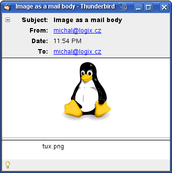
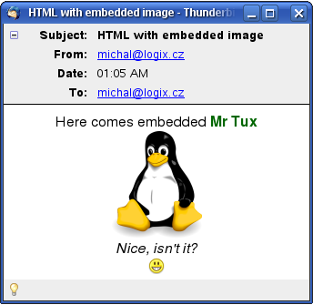

smtp-cli — command line SMTP client
===================================

`smtp-cli` is a powerful **SMTP command line client** with a support for advanced features, such as **STARTTLS**, **SMTP-AUTH**, or **IPv6** and with a scriptable _message composition_ capabilities supporting anything from simple _plain-text_ messages right up to building _complex HTML emails_ with alternative plain-text part, attachments and inline images. The MIME-Type of the attachments can either be guessed automatically or alternatively set on the command line, separately for each attachment if required.

It's also a convenient tool for _testing_ and _debugging_ SMTP servers setups. Even the hardcore mail admins used to typing the SMTP protocol over telnet need a specialised tool when it comes to verifying encryption settings of their TLS enabled server with a subsequent user authentication. Such things are pretty hard to type into a telnet session by hand :-)

The name `smtp-cli` stands for:

1. **smtp-cli**ent
2. **S**mtp-command **L**ine **I**nterface

Use `smtp-cli` if you want to:

1. check mail server capabilities
2. test the server setup
3. create and send complex emails from scripts or cron-jobs

The `smtp-cli` usage is intuitive, everything is scriptable and can run in a completely non-interactive mode from various scripts or cron jobs. It is also ideal for shipping log files from remote machines, running periodical mail delivery test loops, etc. Also if you ever needed to send a complex email with attachments from a command line, this script is all you need.

## Installation

Download the latest release from [smtp-cli on GitHub](https://github.com/mludvig/smtp-cli/releases) and make it executable:

```sh
~ $ wget -o smtp-cli https://github.com/mludvig/smtp-cli/releases/{LATEST_RELEASE}
~ $ chmod +x smtp-cli
```

### Optional dependencies

Some features of smtp-cli are optional and available only when the appropriate perl modules are installed:

* RedHat Enterprise (RHEL), Fedora, Oracle Linux and CentOS users may want to install the following packages:

  ```sh
  $ sudo yum install  perl-IO-Socket-SSL  perl-Digest-HMAC  perl-TermReadKey  \
	                    perl-MIME-Lite  perl-File-LibMagic  perl-IO-Socket-INET6
  ```
  
  If `yum` can't find them all try to enable [EPEL repository](http://fedoraproject.org/wiki/EPEL).

* openSUSE and SUSE Enterprise (SLES) users should install these packages:

  ```sh
  $ sudo zypper install  perl-IO-Socket-SSL  perl-Digest-HMAC  perl-TermReadKey  \
	                       perl-MIME-Lite  perl-File-LibMagic  perl-IO-Socket-INET6
  ```

* Users of Debian, Ubuntu and derivates should install these packages:

  ```sh
  $ sudo apt install  libio-socket-ssl-perl  libdigest-hmac-perl  libterm-readkey-perl \
	                    libmime-lite-perl libfile-libmagic-perl libio-socket-inet6-perl
  ```
 
Users of other Linux distributions will have to find the appropriate packages by themselves, or install the modules directly from [CPAN](http://cpan.perl.org/).

## Donate please :)

Please consider donating, even if it's just enough for a coffee. 

[](https://www.paypal.com/cgi-bin/webscr?cmd=_s-xclick&hosted_button_id=R8BYGL3B24QNE)


## Usage examples

These examples are for _testing_ and _verifying_ mail servers configurations:

### Example 1 - Test your localhost

The simplest example - it will not actually send anything. Only connect to a server, do some SMTP chatting and disconnect.

```
$ ./smtp-cli --verbose --server localhost
[220] 'localhost ESMTP Postfix'
> EHLO localhost
[250] 'localhost'
[250] 'PIPELINING'
[250] 'SIZE 20480000'
[250] 'ETRN'
[250] '8BITMIME'
> QUIT
[221] 'Bye'
```

### Example 2 - Send an e-mail through a host which requires encryption and authentication

Things are getting more interesting. We will use `--server smtp.example.com:587` to connect to port 587
that is usually used by email clients (port 25 is usually for server-to-server communication). Port 587
also _usually_ requires authentication.

For that we'll supply `--user test` and optional `--password ...` to supply the credentials. 
If the password is not supplied we will be asked interactively.

To actually send something we will also supply `--from` and `--to` parameters and also `--data message.txt`. 

Note tat this `message.txt` must contain both the _headers_ and the _message body_. If you don't want to 
bother with creating the message headers yourself use `--body` instead, see the next example for details.

```
$ ./smtp-cli --verbose --host smtp.example.com:587 --enable-auth --user test \
--from test@example.com --to user@another.example.org --data message.txt

[220] 'smtp.example.com ESMTP Postfix'
> EHLO localhost
[250] 'smtp.example.com'
[250] 'PIPELINING'
[250] 'SIZE 10240000'
[250] 'VRFY'
[250] 'ETRN'
[250] 'STARTTLS'
[250] 'XVERP'
[250] '8BITMIME'
Starting TLS...
> STARTTLS
[220] 'Ready to start TLS'
Using cipher: EDH-RSA-DES-CBC3-SHA
Subject Name: /C=XX/CN=smtp.example.com/Email=info@example.com
Issuer  Name: /C=XX/CN=Example.COM Root CA/Email=ca@example.com
> EHLO localhost
[250] 'smtp.example.com'
[250] 'PIPELINING'
[250] 'SIZE 10240000'
[250] 'VRFY'
[250] 'ETRN'
[250] 'AUTH PLAIN LOGIN DIGEST-MD5 CRAM-MD5'
[250] 'AUTH=PLAIN LOGIN DIGEST-MD5 CRAM-MD5'
[250] 'XVERP'
[250] '8BITMIME'
AUTH method (PLAIN LOGIN DIGEST-MD5 CRAM-MD5): using CRAM-MD5
> AUTH CRAM-MD5
[334] 'PDE0OTQyOTcxOC4yNjAwOTYwQHNlcnZlci5kb21haW4udG9wPg=='
> dGVzdCBmOTUyY2RkM2VlODBiMzk1YjYxNDI4NjBlYzg2Y2ExZnJvb3Q=
[235] 'Authentication successful'
Authentication of test@localhost succeeded
> MAIL FROM: <test@example.com>
[250] 'Ok'
> RCPT TO: <user@another.example.org>
[250] 'Ok'
> DATA
[354] 'End data with <CR><LF>.<CR><LF>'
[250] 'Ok: queued as C5C3A299D7'
> QUIT
[221] 'Bye'
```

### Example 3 - Compose a plain text email with attachments
For composing emails you will need an optional `MIME::Lite` perl module. See the _Optional dependencies_ section above for details.

```
$ ./smtp-cli [--server / --auth / --verbose flags] \
             --from test@domain.com --to user@another.domain.org \
             --subject "Simple test with attachments" \
             --body-plain "Log files are attached." \
             --attach /var/log/some.log@text/plain \
             --attach /var/log/other.log
```

This example composes a standard plain text email with two attachments. The interesting part is the syntax used for enforcing _MIME-Type_ of the first attachment. 

The syntax `some.log@text/plain` will make `some.log` attached as **text/plain** part, while the _MIME-Type_ of `other.log` will be guessed by the script and eventually default to **application/octet-stream**.

### Example 4 - Attachment as an email body
```
$ ./smtp-cli [--server / --auth / --verbose flags] \
             --from test@domain.com --to user@another.domain.org \
             --subject "Image as a mail body" \
             --attach /path/to/tux.png
```

If there is only one text or image file to be sent, the file itself could be the message body. At the same time it will be accessible as an attachment with a file name for easy saving. Best to show a screenshot I guess...



There is no _Text_ or _HTML_ body part and the email is not _multipart/mixed_. All that is in the email is Tux the Penguin image. You can immediately see it in your mailer but also can easily save it with its provided name tux.png. The same way it works with text files (or files forced to be text/plain, to be precise).

### Example 5 - Compose a multipart/alternative email with both HTML and Plain text part and inline images

Sending HTML emails is popular, especially among non-technical people. They like to change font colours, backgrounds, embed images and apply all sorts of other useless effects to their one short line of text. Indeed, me and you are more than happy with plain text and we both know that some mail readers can't even display colours and graphics at all (our office manager wouldn't believe!). Therefore it is a good practice for HTML messages to use **multipart/alternative** MIME format with _both_ HTML and TEXT parts. In this example we're going to go wild and even embed an inlined image or two into the HTML part.

First of all prepare the message body. Or bodies, actually. The HTML one is `body.html`:

```html
<!DOCTYPE html PUBLIC "-//W3C//DTD HTML 4.01 Transitional//EN">
<html>
<head></head>
<body bgcolor="#ffffff" text="#000000">
<div align="center">
Here comes embedded <font color="#006600"><b>Mr Tux</b></font><br>
<br>
<i>Nice, isn't it?</i><br>
<br>
</div>
</body>
</html>
```

Note the `` tags with `cid:filename.xyz` source — that's the way to refer _inlined attachments_ from inside the message. We will obviously have to inline-attach `tux.png` and `smiley.png` to the message to make it work.

The second body file is a _plain text_ representation of the above, call it `body.txt`:

```
Here comes embedded Mr Tux
... actually it doesn't ... 
Not in a text-only mail reader.
Sorry
```

That's it. Here comes the magic command line that puts it all together:

```
$ ./smtp-cli --from test@domain.com --to user@another.domain.org \
             --subject "HTML with embedded image" \
             --body-html body.html --body-plain body.txt \
             --attach-inline tux.png --attach-inline smiley.png
```

And this is what we get:



## Donate please :)

Please consider donating, even if it's just enough for a coffee. 

[](https://www.paypal.com/cgi-bin/webscr?cmd=_s-xclick&hosted_button_id=R8BYGL3B24QNE)


## Author

**Michael Ludvig** - get in touch through the [Issues](https://github.com/mludvig/smtp-cli/issues) section above.
